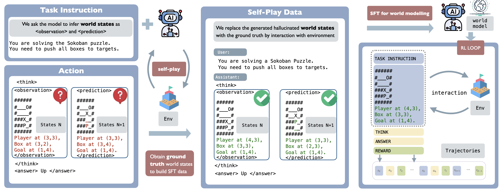

# SPA: Self-Play with World Model for LLM Agents

<p align="center">
  <a href="#homepage"></a>
  <a href="https://arxiv.org/abs/2510.15047"></a>
  <a href="#post"></a>
  <a href="#experiment-log"></a>
  <a href="https://github.com/shiqichen17/SPA"></a>
</p>

---

## Motivation

Large Language Models (LLMs) as agents often struggle in **out-of-distribution (OOD) environments**. These environments are dynamic, governed by task-specific rules and stochasticity, making them difficult to capture using only pretrained knowledge. Standard reinforcement learning (RL) fine-tuning frequently suffers from overfitting: models tend to exploit one narrow trajectory (high Pass@1) while failing to maintain diverse solution coverage (low Pass@k). This brittleness prevents agents from generalizing and scaling to more complex scenarios.

**SPA (Self-Play Agent)** addresses this limitation by equipping LLM agents with an **internal world model** that explicitly represents both environment states and their transitions. By grounding reasoning in structured representations, SPA provides agents with the tools to understand, predict, and plan effectively. This world model is acquired through **self-play supervised finetuning (SFT)**, and then leveraged in downstream **PPO optimization**.

---

## Framework Overview

<p align="center">
  
</p>

SPA integrates three stages into a unified pipeline:

1. **Data Generation**: Collect trajectories where the agent explicitly outputs its current observation and predicted next state before producing an action.
2. **Self-Play SFT**: Replace the model’s imagined world states with ground-truth states provided by the environment, and train the model to internalize this representation.
3. **PPO Training**: Initialize reinforcement learning with the world-model-informed agent, enabling more efficient exploration and robust optimization.

---

## World Modeling

The key innovation of SPA lies in **internalizing environment dynamics** into the agent itself. World modeling is broken into two complementary components:

* **State Representation**: Raw symbolic observations (e.g., Sokoban grids) are mapped into structured, low-perplexity descriptions such as coordinate-based encodings of players, boxes, and goals. This structured representation reduces ambiguity, improves credit assignment, and makes spatial relations explicit.
* **Transition Modeling**: Agents learn to predict how states evolve after actions. This equips them with the ability to anticipate outcomes, plan ahead, and reason about multi-step trajectories.

> Example (Sokoban prompt with structured coordinates):

```
You are solving the Sokoban puzzle. Push all boxes to targets.
State:
######
#__O#
#__X#
###P#
######
Player at (3,3); Box at (2,3); Goal at (1,4).
```

---

## Training Objectives

SPA jointly optimizes two objectives:

* **World Model SFT**: Cross-entropy loss applied only to world-model-relevant tokens (`<think>` and `<answer>` spans), ensuring the agent learns state grounding and transition prediction.
* **Policy Optimization (PPO)**: Rewards are applied solely to `<answer>` tokens, allowing RL to focus on action quality while leveraging the internalized world model for stability and efficiency.

This separation enforces a clean division: SFT captures the environment’s rules, PPO learns how to act optimally within them.

---

## Results

### Performance Gains

* **Sokoban**: Success rate improves from **25.6% → 59.8%** (Qwen2.5-1.5B-Instruct).
* **FrozenLake**: Success improves from **22.1% → 70.9%**.
* **Sudoku**: SPA enables models to solve puzzles that vanilla RL cannot.

### Generalization Across Models

SPA scales consistently across sizes and families:

* **Qwen2.5-0.5B-Instruct** and **Qwen2.5-3B** both benefit significantly.
* **LLaMA-3.2-1B-Instruct** shows the same stability and performance gains.

### State Perplexity

Structured states dramatically reduce perplexity:

* Sokoban: 163.9 → **19.6**
* FrozenLake: 187.1 → **15.4**
* Sudoku: 15.5 → **7.3**

---

## What Contributes to Successful World Modeling and Generalization?

### Effect of Transition Modeling

Transition-model learning is central to RL scaling. When the SFT loss on current and next states is masked out, PPO training shows no improvement. This confirms that the ability to predict future states is indispensable for effective policy learning.

### Effect of Ground Truth

Ground-truth coordinates are critical. Without explicit spatial grounding, the model struggles to align its predictions with environment dynamics. Experiments show that randomizing coordinates leads to collapse in performance, highlighting the necessity of structured state descriptions.

### Effect of Initial Policy for Exploration

Effective exploration depends heavily on the initial policy. Replacing the RL policy with random actions to generate world-modeling trajectories degrades downstream learning. Self-play generates higher-quality data aligned with the agent’s reasoning and exploration trajectory, producing more robust world models.

### Exploration-Exploitation Balance

SPA-trained agents sustain higher Pass@k scores over time, suggesting improved coverage of diverse solution paths while still exploiting efficient strategies.

### Easy-to-Hard Transfer

Training a world model on simple tasks (FrozenLake 4×4) significantly accelerates convergence and improves asymptotic performance on more difficult variants (FrozenLake 6×6).

### Generalization Limits

While intra-domain transfer works well (easy-to-hard), cross-environment transfer (e.g., Sokoban → FrozenLake) remains limited, showing that environment-specific modeling is still necessary.

### Mechanisms Behind SPA's Effectiveness

1. **Grounding reduces ambiguity**: Structured observations ensure spatial relations are explicit and unambiguous.
2. **Transition modeling teaches causality**: Agents learn to anticipate the consequences of actions, rather than memorizing observed outcomes.
3. **Self-play ensures relevance**: Data generated through self-play reflects the distribution of states the agent will actually encounter.
4. **Joint optimization balances knowledge and action**: SFT teaches the rules, PPO refines the action policy.

Together, these findings explain why SPA consistently outperforms vanilla RL and online world-modeling baselines.

---

## Example Trace

```text
<think>
  <observation>
  ######
  #__O#
  #_X_#
  ###P#
  ######
  Player at (3,3); Box at (2,3); Goal at (1,4).
  </observation>
  <prediction>
  ######
  #__O#
  #___#
  ###XP
  ######
  </prediction>
</think>
<answer>Up</answer>
```

---

## Limitations

* Cross-game transfer remains limited; world models are environment-specific.
* Reliance on structured encodings may not directly apply to highly unstructured or multimodal domains.
* Scaling SPA to open-ended environments with complex tool use requires further work.

---

## Citation

```bibtex
@misc{chen2025spa,
      title={Internalizing World Models via Self-Play Finetuning for Agentic RL}, 
      author={Shiqi Chen and Tongyao Zhu and Zian Wang and Jinghan Zhang and Kangrui Wang and Siyang Gao and Teng Xiao and Yee Whye Teh and Junxian He and Manling Li},
      year={2025},
      eprint={2510.15047},
      archivePrefix={arXiv},
      primaryClass={cs.LG},
      url={https://arxiv.org/abs/2510.15047}, 
}
```
